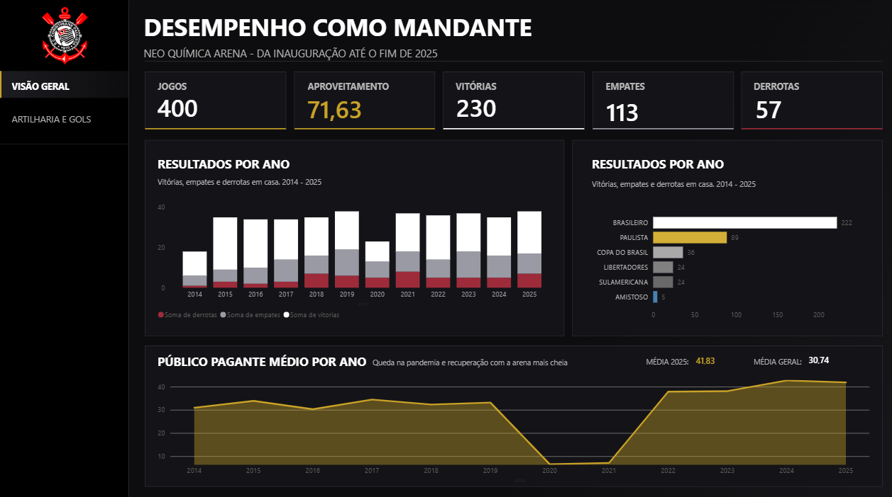
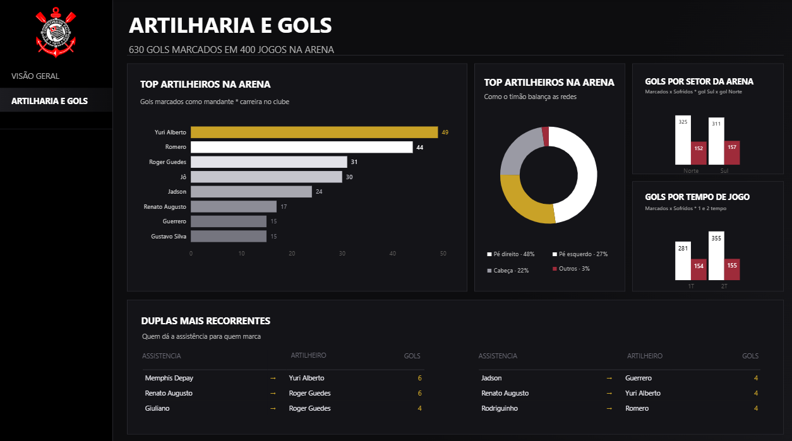

# Arena Corinthians Analytics

Projeto de análise de dados sobre o desempenho do Corinthians como mandante na Neo Química Arena, cobrindo o período desde a inauguração do estádio até o fim de 2025. Inclui pipeline de ETL, banco de dados relacional e um dashboard interativo em Power BI.

## 📊 Sobre o projeto

O projeto analisa jogos, resultados, artilharia e comportamento do público nos jogos do Corinthians como mandante, cruzando dados de diferentes competições (Brasileiro, Paulista, Copa do Brasil, Libertadores, Sul-Americana e amistosos).

O dashboard final é dividido em duas páginas:

- **Visão Geral** — desempenho como mandante: jogos, aproveitamento, vitórias, empates e derrotas por ano e por competição, além do público pagante médio ao longo dos anos.
- **Artilharia e Gols** — artilheiros do time na arena, estilo dos gols (pé direito, pé esquerdo, cabeça), distribuição por setor do estádio e por tempo de jogo, e as duplas mais recorrentes de assistência e finalização.

## 🗂️ Estrutura do projeto
arena-corinthians-analytics/
    ├── dashboard/ # Arquivo do Power BI (power_bi.pbix)
    ├── data/
    │ └── raw/ # Dados brutos extraídos da fonte original
    │ └── processed/ # Dados processados após transform
    ├── db/ # Configuração de conexão com o banco de dados
    ├── etl/ # Scripts de extração, transformação e carga (extract.py, transform.py, load.py)
    ├── sql/ # Views SQL utilizadas nas análises (schema.sql, views.sql)
    ├── main.py # Ponto de entrada do pipeline
    ├── requirements.txt # Dependências do projeto
    └── .env.example # Exemplo de variáveis de ambiente necessárias

## 🛠️ Tecnologias utilizadas

- **Python** — pipeline de ETL
- **PostgreSQL** — armazenamento e modelagem dos dados
- **SQL** — criação de views para consumo direto no dashboard
- **Power BI** — visualização e apresentação dos dados

## 📥 Fonte dos dados

Os dados brutos utilizados neste projeto foram obtidos através da **API do Kaggle**.

## 🚀 Como rodar o projeto

1. Clone o repositório:
```bash
   git clone https://github.com/FelipeWroblewski/arena-corinthians-analytics.git
   cd arena-corinthians-analytics
```

2. Instale as dependências:
```bash
   pip install -r requirements.txt
```

3. Configure as variáveis de ambiente:
   - Copie o arquivo `.env_example` para `.env`
   - Preencha com as credenciais do seu banco PostgreSQL e da API do Kaggle

4. Execute o pipeline:
```bash
   python main.py
```

5. Abra `dashboard/power_bi.pbix` no Power BI Desktop para visualizar o dashboard.
## 📸 Dashboard


